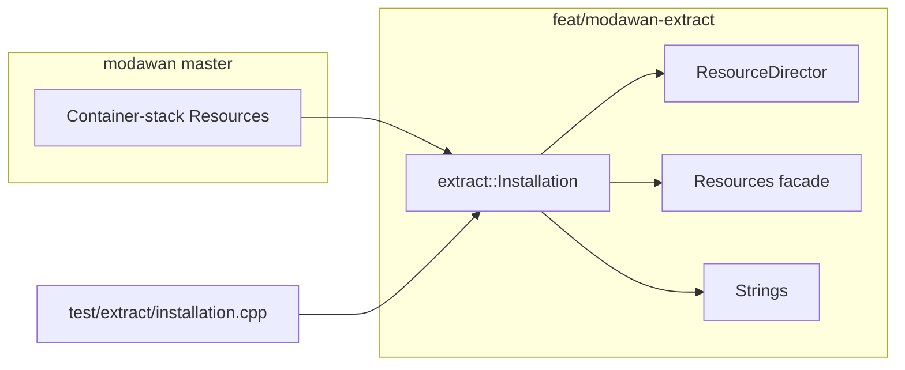

# feat: modawan resource-loader PR (PR #111 split slice 1)

## Summary

Open the **first** of three modawan downstream PRs: PyKotor-style `extract::Installation` resource loading, wired through `Resources`/`Director`/`Strings`, with `test/extract/installation.cpp` green on Linux and Windows CI. Source from OpenKotOR `master` @ `8a8020b2`; base modawan `master` @ `48b2ea3e`. No WASM or GLES-only files in this PR.

## Problem Frame

modawan/reone#111 mixed three concerns; Eldbury and modawan need a **narrow resource-loader PR** to review and benchmark before GLES and WASM land. OpenKotOR already merged the extract layer (~60 files on the downstream branch, ~2k net lines vs modawan `master`). modawan #167 must not merge as a monolith (see origin R3, R13).

## Requirements

| ID | Requirement |
|----|-------------|
| R1 | Branch `feat/modawan-extract` from `upstream/master` (`48b2ea3e`), apply extract slice from OpenKotOR `master` |
| R2 | Touch only resource-loader bucket: extract headers/sources, director/resources/strings/di, container removals, dataminer/toolkit consumers, related tests — no `tools/web/*`, no `glsl/*`, no `extern/glad/*` |
| R3 | `test/extract/installation.cpp` and updated `test/resource/resources.cpp`, `test/resource/strings.cpp` pass via `ctest` on Linux and Windows |
| R4 | Open modawan PR with test plan covering module-root lazy index, override order, `dialog.tlk` resolution, and save-scope custom capsules |
| R5 | PR body documents nested savegame ERF status and dependency on modawan #165/#168 for full save/load UX |
| R6 | Link new PR from comments on modawan #111 and #167; supersede #167 monolith merge request |
| R7 | Strip or `#ifdef` isolate `chitin.cpp` `__EMSCRIPTEN__` BIF hook in this native-first PR — defer WASM hook to slice 3 unless required for compile |

Traceability: plan R2 → origin R5 (extract scope); plan R3 → origin R6 (Linux/Windows tests); plan R5 → origin R7 (nested ERF / #165/#168 note); plan R6 → origin R3–R4 (supersede #167, link #111). Origin R12–R14 deferred to process-cleanup follow-up.

---

## Key Technical Decisions

- **KTD1 — Slice by path, not by commit replay:** Apply the file set from `git diff upstream/master...origin/master` filtered to extract bucket (~42 core extract paths; ~57–60 files landed including compile/test dependencies and save-scope follow-ups). Do not replay #111's 80-commit history; OpenKotOR commits are interleaved with GLES/WASM.
- **KTD2 — Branch on OpenKotOR fork:** `OpenKotOR:feat/modawan-extract` → modawan `master` (resolves origin O1). Push to `origin`, open PR with `gh pr create --repo modawan/reone --head OpenKotOR:feat/modawan-extract`.
- **KTD3 — WASM hook deferred:** `src/libs/resource/extract/chitin.cpp` Emscripten `reoneWebGetBifIndexBytes` stays behind `#ifdef __EMSCRIPTEN__`; native modawan build unaffected. Slice 3 adds the hook when WASM lands.
- **KTD4 — Container cleanup assumed landed:** KeyBif/Folder/Rim/Exe/Memory containers already removed on OpenKotOR (#6, #11). Slice brings that deletion to modawan; do not reintroduce legacy containers.
- **KTD5 — #165/#168 out of scope:** Note in PR body that party deserialize (#165) and game reset (#168) are separate; loader must support nested ERF via `LazyCapsule` + save-scope folders but full save UX is follow-up.

---

## High-Level Technical Design

**Load order (unchanged from OpenKotOR):** `ResourceModule` constructs `Installation(gameId, path)` → `Resources::useInstallation` → `Director::init` / scope mutations → `Strings::init(installation)`.

---

## Scope Boundaries

**In scope:** Extract layer port, wiring, tests, modawan PR open, supersede comments.

**Out of scope:** GLES PR (slice 2), WASM PR (slice 3), merging #165/#168, UI save/load menu.

### Deferred to Follow-Up Work

- modawan GLES PR (`feat/modawan-gles`) after slice 1 merges
- modawan WASM PR (`feat/modawan-wasm`) after slice 2 merges
- Benchmark script comparing old vs new lookup (PuritanWizard offered; optional after review)

---

## Implementation Units

### U1. Create extract branch from modawan master

**Goal:** Isolated branch with only modawan `master` as base.

**Requirements:** R1

**Dependencies:** none

**Files:** (branch only)

**Approach:** `git fetch upstream && git checkout -b feat/modawan-extract upstream/master`. Record base SHA `48b2ea3e` in PR body.

**Verification:** Branch tip equals `upstream/master`; no OpenKotOR-only doc commits.

---

### U2. Apply extract file slice from OpenKotOR master

**Goal:** Land the path-filtered extract diff on the branch (~42 core paths; expect compile-driven additions).

**Requirements:** R1, R2, R7

**Dependencies:** U1

**Files:**
- `include/reone/extract/capsule.h`
- `include/reone/extract/chitin.h`
- `include/reone/extract/fileresource.h`
- `include/reone/extract/finder.h`
- `include/reone/extract/installation.h`
- `include/reone/extract/lookupcontext.h`
- `include/reone/extract/searchlocation.h`
- `include/reone/resource/di/module.h`
- `include/reone/resource/director.h`
- `include/reone/resource/provider/movies.h`
- `include/reone/resource/resources.h`
- `include/reone/resource/strings.h`
- `src/libs/resource/extract/capsule.cpp`
- `src/libs/resource/extract/chitin.cpp`
- `src/libs/resource/extract/fileresource.cpp`
- `src/libs/resource/extract/finder.cpp`
- `src/libs/resource/extract/installation.cpp`
- `src/libs/resource/di/module.cpp`
- `src/libs/resource/director.cpp`
- `src/libs/resource/resources.cpp`
- `src/libs/resource/strings.cpp`
- `src/libs/resource/provider/audioclips.cpp`
- `src/libs/resource/provider/movies.cpp`
- `src/libs/resource/provider/textures.cpp`
- `src/libs/resource/CMakeLists.txt`
- `src/apps/dataminer/models.cpp`
- `src/apps/toolkit/viewmodel/resource/explorer.cpp`
- Deleted: `include/reone/resource/container/*` (exe, keybif, rim, folder, memory, utils)
- Deleted: `src/libs/resource/container/*` (erf, exe, folder, keybif, rim)
- `test/extract/installation.cpp`
- `test/fixtures/resource.h`
- `test/resource/resources.cpp`
- `test/resource/strings.cpp`
- `test/CMakeLists.txt`

**Approach:** `git checkout origin/master -- <paths>` for each path; resolve conflicts favoring OpenKotOR extract semantics. Pull minimal `CMakeLists.txt` hunks only if required for new sources/tests.

**Patterns to follow:** `include/reone/extract/installation.h`, `src/libs/resource/di/module.cpp` on `origin/master`.

**Test scenarios:**
- Happy path: override folder wins over chitin for same `resref` per `canonicalSearchOrder`
- Module root: `setModuleRoot("end_m01aa")` lazy-indexes only that module's RIM/MOD
- Loose file: `resolveLooseRelativePath("dialog.tlk", talkTableSearchOrder())` finds TLK
- Save scope: `setCustomCapsules` with `.sav` ERF readable via `LazyCapsule`
- Edge: empty override dir does not break chitin lookup

**Verification:** Local `cmake --build` + `ctest -R UnitTests` passes.

---

### U3. Fix modawan-specific compile gaps

**Goal:** Branch builds on modawan CI (Linux + Windows) without GLES/WASM deps.

**Requirements:** R2, R3, R7

**Dependencies:** U2

**Files:** Any from U2 that fail compile on modawan baseline (likely `director.cpp` if modawan lacks recent game patches — keep WASM `EM_ASM` blocks behind `#ifdef __EMSCRIPTEN__` only).

**Approach:** Build locally against `upstream/master` toolchain; patch only compile/link errors introduced by slice. Do not pull GLES or web files to fix unrelated gaps.

**Verification:** Clean Release build; `tests` executable runs extract tests.

---

### U4. Open modawan PR and supersede monolith handoff

**Goal:** Reviewable PR open; #167 held.

**Requirements:** R4, R5, R6

**Dependencies:** U3

**Files:**
- `docs/residual-review-findings/e10db735-modawan-167-handoff.md` (mark superseded — optional doc commit on OpenKotOR)
- PR description on modawan (not a repo file)

**Approach:** Push `feat/modawan-extract` to `origin`; `gh pr create --repo modawan/reone --base master --head OpenKotOR:feat/modawan-extract`. Test plan checklist: module transition spot-check, `ctest`, nested SAV note, #165/#168 dependency. Comment on #111 and #167 with PR link.

**Verification:** PR open, MERGEABLE, CI dispatched; #167 comment references new PR.

---

## Risks and Mitigations

| Risk | Mitigation |
|------|------------|
| Interleaved OpenKotOR commits pull WASM/GLES hunks | Path-filtered checkout only (U2 file list) |
| modawan `master` diverged from expected base | Record actual base SHA in PR; rebase if needed |
| Savegame nested ERF incomplete | Document in PR; cite #165/#168; `LazyCapsule` SAV support in tests |
| Director WASM logging confuses reviewers | Keep `__EMSCRIPTEN__` blocks; native build unaffected |

## Open Questions

- **O1 (resolved):** Branch on OpenKotOR fork → modawan PR (KTD2).
- **O2 (deferred):** #165/#168 merge order — after slice 1 unless maintainer requests otherwise.
- **O3:** Stop updating `glad-gles` until slice 1 open — recommend yes; note in PR comment.

## Sources and Research

- Origin: `docs/brainstorms/2026-06-11-pr111-three-way-split-requirements.md`
- Strategy: `STRATEGY.md`
- Cortisol design reviews: modawan/reone#111 review threads
- Repo: extract layer on `origin/master`; branch tip `92011407` on modawan PR #192 (commits `38fb0853`, `3739e548`, `fba857dd5`, `92011407`); Windows CI pending maintainer workflow approval
